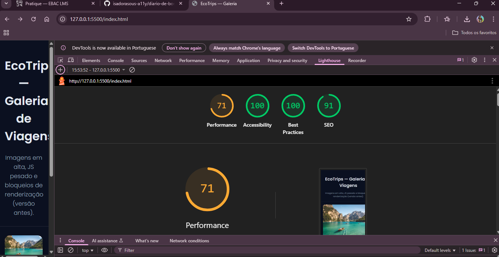
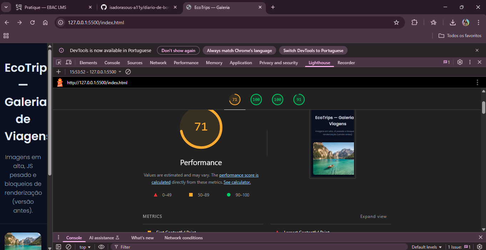
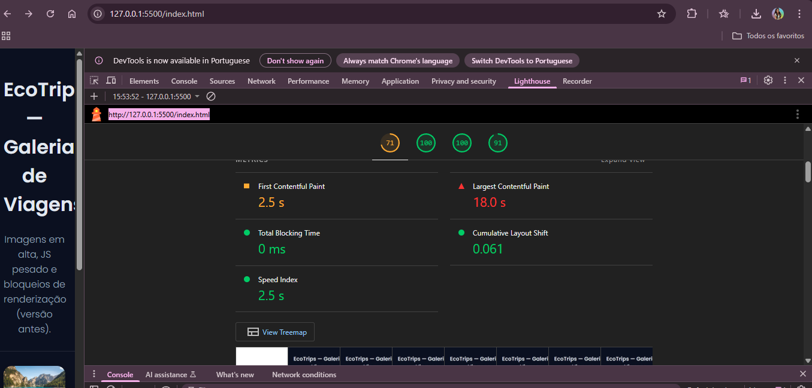
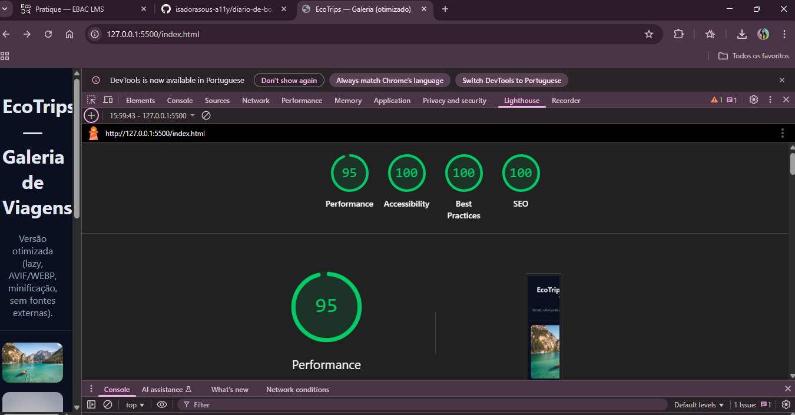
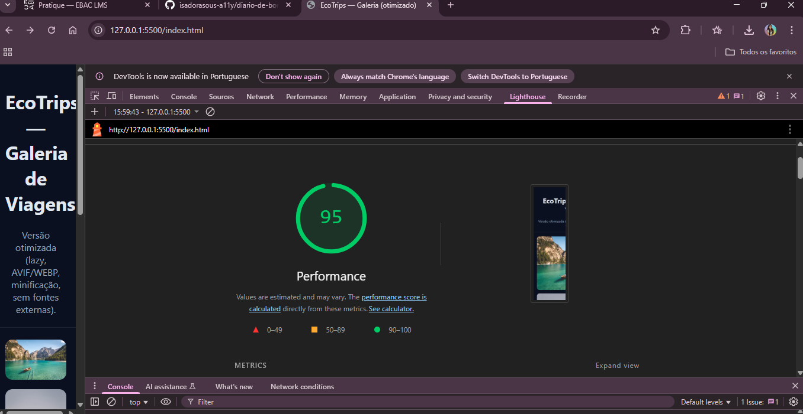
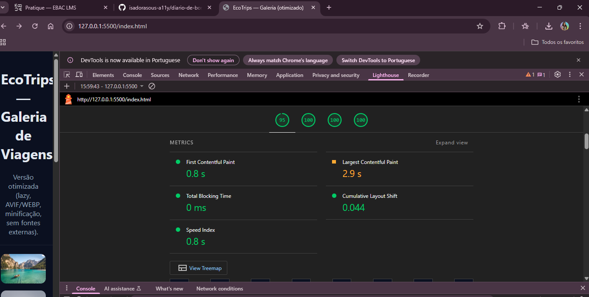

# EcoTrips — Estudo de Performance Web

Projeto estático com duas versões para avaliação de performance:
- **before/**: versão com gargalos propositais
- **after/**: versão otimizada (imagens AVIF/WEBP, lazy, minificação, remoção de código morto)

## Como rodar
```bash
npx http-server -p 3000 .
# http://127.0.0.1:3000/before/
# http://127.0.0.1:3000/after/

# Análise Inicial (Lighthouse - Antes)
Gargalos detectados

Fonte Google bloqueando renderização.

JS síncrono e loop pesado (bloqueio).

Imagens JPG muito grandes, sem lazy e sem srcset.

CSS não minificado e com regras não utilizadas.

Recursos sem defer ou otimização.

Prints (Before)
<p align="center">    </p>


# Reanálise (Lighthouse - Depois)
Melhorias aplicadas

Imagens → uso de AVIF/WEBP via auto=format, srcset, sizes, loading="lazy", decoding="async + dimensões fixas.

Fonts → removido Google Fonts, adotado system font stack.

JS → minificado, sem loops bloqueantes, type="module" + defer.

CSS → crítico inline + minificação, remoção de estilos não usados.

HTML → preload da imagem principal, minificação, ordem de recursos otimizada.

Prints (After)
<p align="center">    </p>

# Comparativo before x after

Performance: subiu de 71% → 95% (conforme prints).

Best Practices: manteve 100% em ambos

SEO: subiu de 91% → 100% (conforme prints)

Accessibility: melhorou com uso de alt + dimensões fixas.

Impacto real: tempo de carregamento mais rápido, menos bytes transferidos, renderização sem bloqueios, experiência mobile estável.